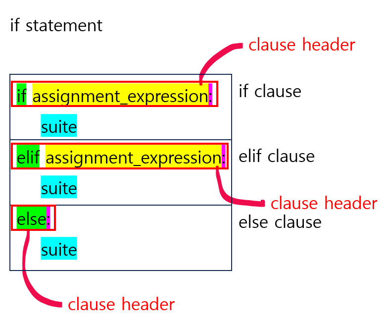
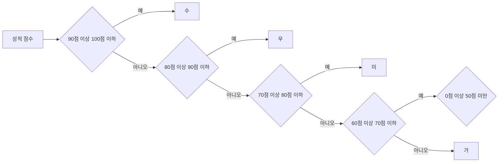

## `if` 문

이번 섹션에선 파이썬 조건문에 해당하는 `if` 문에 대해 알아본다.

### `if` 문의 개념



* `if` 절 (필수): if 키워드 뒤에 식<sub>assignment_expression</sub>을 평가하고 결과가 참<sub>True</sub>으로 평가되는 경우 스위트를 실행한다. 
* `elif` 절 (선택): `if` 절 또는 `elif` 절 뒤에 여러개의 `elif` 절이 나올 수 있으며, 식이 참으로 평가되면 스위트를 실행한다. 
* `else` 절 (선택): 모든 `if` 와 `elif` 조건이 거짓일 경우 실행할 스위트를 지정하는 else 절이다.

`if` 절과 `elif` 절은 식이 필수이며, 이 식의 불리언 값이 True 인 경우 스위트를 실행된다.
각 절은 조건을 만족하는 경우 하위 절은 검사하지 않으며, 조건 불만족 시 하위 절을 검사하게된다.

파이썬 제어문에서 사용되는 용어가 혼란스러울 수 있어 아래에 자세히 정리하였다.
**절<sub>clause</sub>**, **절 헤더<sub>clause header</sub>**, **스위트<sub>suite</sub>** 는 모든 제어문에서 공통적으로 사용되는 용어이다.

* 절: 하나의 완전한 제어 구문 블록으로, 절 헤더와 스위트로 구성된다. 그림에는 `if` 절, `elif` 절, `else` 절이 있다.
* 절 헤더: 제어 구문의 첫 번째 줄로, 키워드(그림에서 `if`, `elif`, `else` 에 해당)부터 콜론(`:`)으로 끝난다.
* 스위트: 절 헤더 다음에 오는 실행 코드 블록으로, 일반적으로 들여쓰기로 구분된다. 한 줄 또는 여러 줄의 코드로 구성될 수 있다.

### `if` ~ `elif` ~ `else` 사용 예제

다음은 사용자로부터 정수를 입력 받아 음수인지 판별하는 프로그램이다.

```python
user_number = int(input("정수를 입력해주세요: "))

if user_number < 0:
    print("음수 입니다.")
```
```
>>>
정수를 입력해주세요: -1
음수 입니다.
```
```
>>>
정수를 입력해주세요: 3

```

프로그램을 확장하여 입력받은 값이 양의 정수일 때 '음수가 아닙니다.' 를 출력하도록 만들어보자. 
`else` 키워드는 조건문의 마지막에 작성해야하고, 앞선 조건절이 모두 거짓일 때 스위트가 실행된다.

```python
user_number = int(input("정수를 입력해주세요: "))

if user_number < 0:
    print("음수 입니다.")
else:
    print("음수가 아닙니다.")
```
```
>>>
정수를 입력해주세요: 3
음수가 아닙니다.
```

정수는 양의 정수 / 음의 정수 / 0 으로 구분된다.
다음은 입력받은 정수 값에 따라 양수인지, 음수인지, 0 인지 판별하는 프로그램 예제이다.

```python
user_number = int(input("정수를 입력해주세요: "))

if user_number < 0:
    print("음수 입니다.")
elif user_number == 0:
    print("0 입니다.")
else:
    print("양수 입니다.")
```
```
>>>
정수를 입력해주세요: -1
음수 입니다.
```
```
>>>
정수를 입력해주세요: 0
0 입니다.
```
```
>>>
정수를 입력해주세요: 100
양수 입니다.
```

`if` 문은 `if` 문 내부에 중첩하여 사용할 수 있다.  이를 활용하면 더 복잡한 조건 분기를 구현할 수 있다.

앞서 만든 프로그램에 다음 기능을 추가한다.

* 100 보다 큰 경우 '매우 큰 양수 입니다.' 를 출력
* 1 인 경우 '1 입니다.' 를 출력

```python
user_number = int(input("정수를 입력해주세요: "))

if user_number < 0:
    print("음수 입니다.")
elif user_number == 0:
    print("0 입니다.")
elif user_number == 1:
    print("1 입니다.")
else:
    if user_number > 100:
        print("매우 큰 양수 입니다.")
    else:
        print("양수 입니다.")
```
```
>>>
정수를 입력해주세요: 1
1 입니다.
```
```
>>>
정수를 입력해주세요: 2025
매우 큰 양수 입니다.
```

## 삼항 연산자

삼항 연산자는 한 줄에 `if` ~ `else` 절을 사용하는 기법이다.
`a if 조건식 else b` 형태로 사용하고 조건식을 만족하면 a 를, 만족하지 않으면 b 를 실행한다.

다음은 삼항 연산자를 사용했을 때와 아닐 때를 비교한 예이다.
변수 number 가 0 보다 크면 is_positive 변수에 `True` 를 할당하고, 아닌 경우 `False` 를 할당한다.

**삼항 연산자를 사용하지 않음**
```python
number = int(input("숫자를 입력해주세요: "))

is_positive = False

if number > 0:
    is_positive = True
    
print(is_positive)
```

**삼항 연산자를 사용**
```python
number = int(input("숫자를 입력해주세요: "))

is_positive = True if number > 0 else False
print(is_positive)
```

이렇듯 삼항 연산자는 코드를 간결하게 하는데 도움을 주지만, 식이 길어짐에 따라 가독성이 떨어질 수 있다는 점에 유의해야 한다.

## 자료형의 참과 거짓

파이썬에서는 모든 객체가 참 또는 거짓으로 평가될 수 있다.
예를 들면 정수 0, 빈 리스트, 빈 문자열 등은 `False` 로 평가된다.

| 자료형        | 값     |
|------------|-------|
| bool       | False |
| None       | None  |
| str        | ""    |
| int        | 0     |
| float      | 0.0   |
| list       | []    |
| tuple      | ()    |
| dictionary | {}    |

## 논리 연산자 사용

논리 연산자를 사용하여 두 조건이 식을 만족할 때 코드를 실행하게 하거나, 어느 하나라도 식을 만족할 때 코드를 실행하도록 할 수 있다.

**`and` 사용**  
`A and B` 형태로 사용하며 A, B 두 식이 `True` 인 경우 스위트를 실행한다.

```python
a = 3
b = 5

if a >= 0 and b > a:
    print("실행-1")

if a >= 0 and b < a:
    print("실행-2")
```
```
>>>
실행-1
```

위 예제에서 첫 번째 `if` 문은 두 식을 만족하여 스위트가 실행되었고, 두 번째 `if` 문은 `b < a` 의 평가가 `False` 이기 때문에 스위트가 실행되지 않았다.

**`or` 사용**
`A or B` 형태로 사용하며 A, B 두 식중 어느 하나라도 `True` 로 평가되면 스위트를 실행한다.

```python
a = ["고추잠자리", "꿀벌", "귀뚜라미"]
b = 5

if "잠자리" in a or b >= 0:
    print("실행-1")

if "고추잠자리" in a or b == 0:
    print("실행-2")

```
```
>>>
실행-1
실행-2
```

첫 번째 `if` 문은 `"잠자리" in a` 가 `False` 로 평가되지만, `b >= 0` 가 `True` 로 평가되어 스위트가 실행되었다.
두 번째 `if` 문은 `"고추잠자리" in a` 가 `True` 로 평가되어 스위트가 실행되었다.

**`not` 사용**  

`not` 연산자는 식의 부울 평가를 반전시킨다.
예를들면 not 뒤의 식이 `True` 이면 `False` 를 반환하고, `False` 이면 `True` 를 반환한다.

다음은 리스트가 비었는지 확인하는 예제이다.

```python
a = []

if not a:
    print("빈 리스트입니다.")
```
```
>>>
빈 리스트입니다.
```

## 연습 문제

### 연습 문제1

다음과 같은 리스트가 있습니다.

```python
animals = ["토끼", "거북이", "개", "고양이", "오리", "원숭이"]
```

사용자 입력을 받은 문자열이 리스트 animals 에 포함되어 있는지 확인 하는 프로그램을 만들어 보세요.
```
동물을 입력해주세요: 거미 
리스트에 포함되지 않은 동물입니다.
```
```
동물을 입력해주세요: 거북이 
리스트에 포함된 동물입니다.
```

### 연습 문제2

사용자로 부터 정수를 입력받아, 짝수인지 홀수인지 판별하는 프로그램을 만들어 보세요.

```
정수를 입력해주세요: 3
홀수입니다!
```
```
정수를 입력해주세요: 2
짝수입니다!
```

### 연습 문제3

연도를 입력받아 윤년인지 아닌지 판별하세요.
윤년은 다음 조건을 만족해야 합니다.

* 4 로 나누어 떨어지는 연도는 윤년입니다.
* 그러나 100 으로 나누어 떨어지는 연도는 윤년이 아닙니다.
* 단, 400 으로 나누어 떨어지는 연도는 윤년입니다.

```
연도를 입력해주세요: 2024
윤년입니다.
```
```
연도를 입력해주세요: 2025
윤년이 아닙니다.
```
```
연도를 입력해주세요: 2100
윤년이 아닙니다.
```
```
연도를 입력해주세요: 2400
윤년입니다.
```

### 연습 문제4



점수를 입력받아 수, 우, 미, 양, 가를 판별하세요.
만점은 추가로 "만점입니다!" 를 출력합니다.

점수 기준은 다음과 같습니다.

* 90 점 이상 100 점 이하: 수
* 80 점 이상 90 점 미만: 우
* 70 점 이상 80 점 미만: 미
* 60 점 이상 70 점 미만: 양
* 0 점 이상 60 점 미만: 가

### 연습 문제5

컴퓨터를 상대하는 가위, 바위, 보 게임을 만들어 보세요.

> {: .note }  
> `random` 모듈의 `randint(a, b)` 함수는 정수 a ~ 정수 b 사이의 정수를 생성 후 반환합니다.
> 자세한 사용법에 대해서는 [random 모듈](../../내장_라이브러리/random_모듈.md)을 참고합니다.

```
가위, 바위, 보: 보
비겼습니다.
컴퓨터: 보
당신: 보
```
```
가위, 바위, 보: 바위
패배했습니다.
컴퓨터: 보
당신: 바위
```
```
가위, 바위, 보: 가위
승리했습니다.
컴퓨터: 보
당신: 가위
```