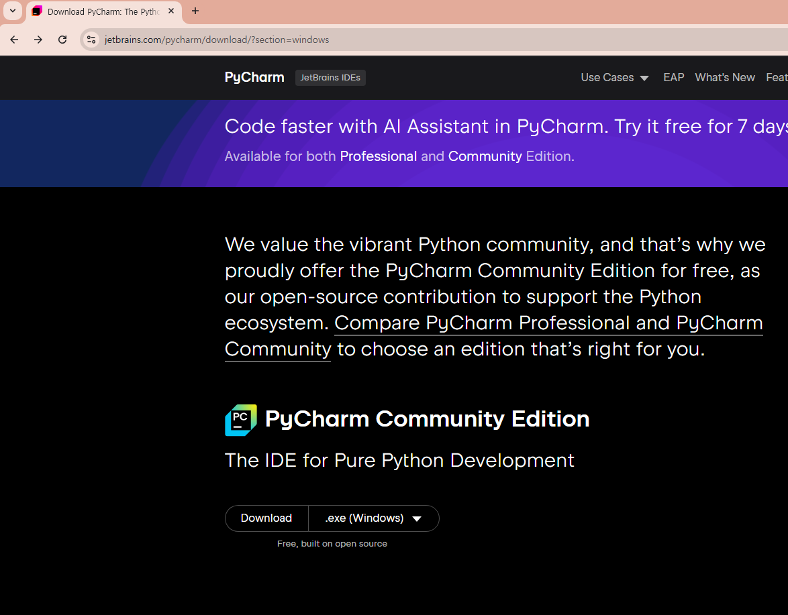
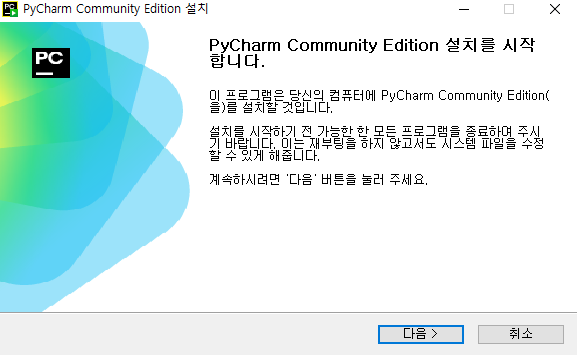
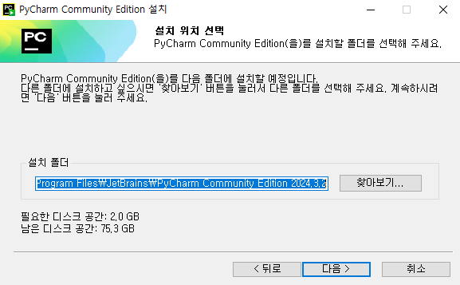
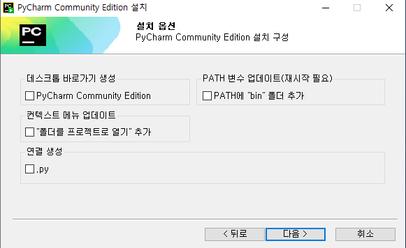
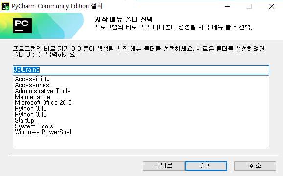
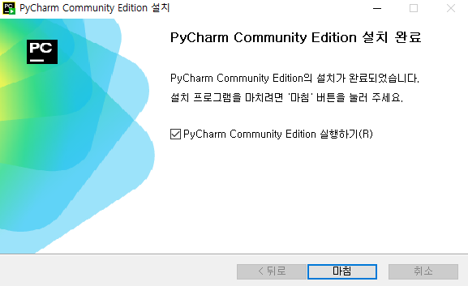
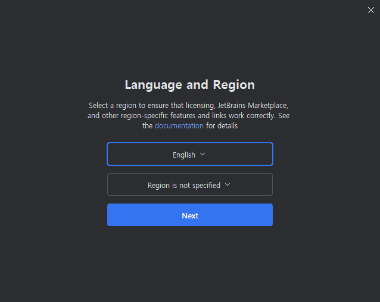
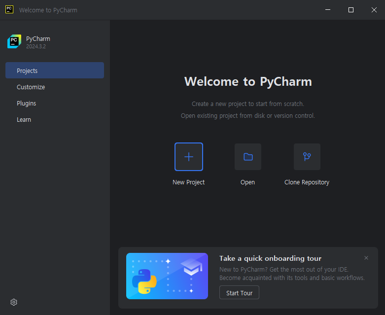

# Pycharm 설치  

## Pycharm 다운로드  

* 아래 링크에서 PyCharm Community Edition 다운로드  
[https://www.jetbrains.com/pycharm/download/](https://www.jetbrains.com/pycharm/download/)  
  

## Pycharm 설치  
  
  
  
  
  

## Pycharm 실행
  
  